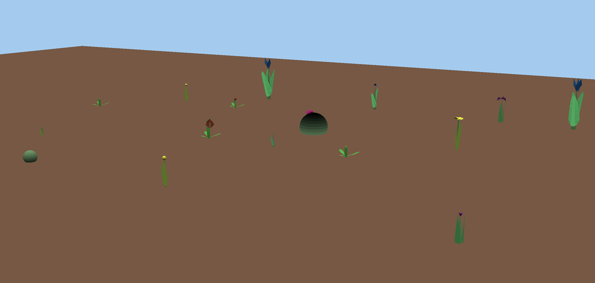

# Tangram Garden

Author: Russell Emerine

Design:
Tangram Garden is a relaxing garden simulator.
You water flowers, then collect the shaped petals to complete tangram puzzles.

Screen Shot:

How To Play:
Walk with WASD, look around with mouse.
Water your flowers by holding left click.
(Look down, the flowers sometimes grow very close to you.)
Collect a flower with right click.
When you have enough of each type of petal, you can
walk up to a tangram and right click to complete it.

This game was built with [NEST](NEST.md).
